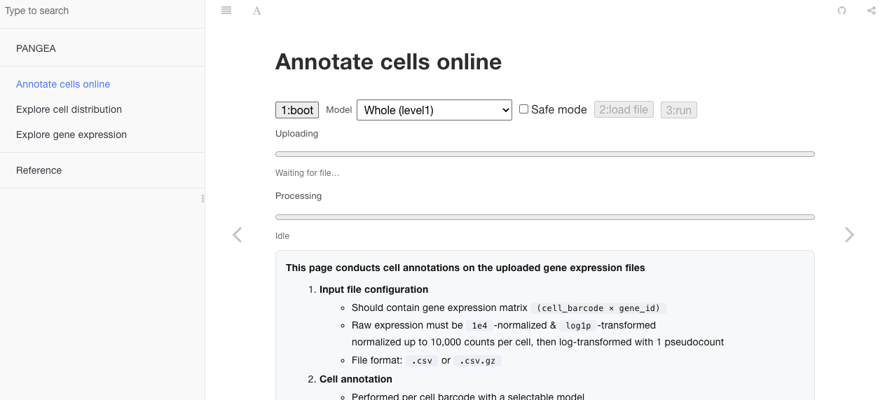

# 🌏 pangeapy

`pangeapy` is a Python package designed for **automated cell type annotation** and **metadata prediction** using the **PANGEA reference atlas**.
It enables researchers to easily label single-cell transcriptomic data and predict higher-level phenotypic contexts such as organ or disease state, with minimal preprocessing.

PANGEA reference model can be accessed in two ways:
1. **Web interface** — Perform cell annotation and explore PANGEA
2. **Python package** — Integrate annotation and prediction into reproducible pipeline

## 1) Web interface

You can try cell annotation and explore the PANGEA reference atlas directly at **[https://srkim727.github.io/](https://srkim727.github.io/)**.
*(No installation required)*

### What you can do
1. **Annotate cells** — Upload `.csv` or `.csv.gz` gene expression files and automatically assign cell labels using PANGEA models  
2. **Explore cell distributions** — Visualize organ- and tissue-level patterns  
3. **Explore gene expression** — Plot expression of multiple genes across all cell types



## 2) Python package

### Installation

(1) Create a Conda environment

```bash
conda create -n pangea python=3.11
conda activate pangea
```

(2) Install via GitHub

```bash
pip install --user git+https://github.com/srkim727/pangeapy.git
```
### Quick start:

```python
from pangeapy import CellAnnotator, MetaAnnotator

pred = CellAnnotator().annotate(adata)
meta = MetaAnnotator().annotate(pred)
```

### Tutorials

| Task | Notebook |
|------|-----------|
| 01 Cell Annotation | [01_vignette_cell_annotation.ipynb](https://github.com/srkim727/pangeapy/blob/main/docs/01_vignette_cell_annotation.ipynb) |
| 02 Metadata Annotation | [02_vignette_meta_annotation.ipynb](https://github.com/srkim727/pangeapy/blob/main/docs/02_vignette_meta_annotation.ipynb) |
| 03 Missing Cell Type Detection | [03_vignette_identifying_missing_cells.ipynb](https://github.com/srkim727/pangeapy/blob/main/docs/03_vignette_identifying_missing_cells.ipynb) |


### Requirements
celltypist
scipy
parmap


### Citation

Kim, unpublished
